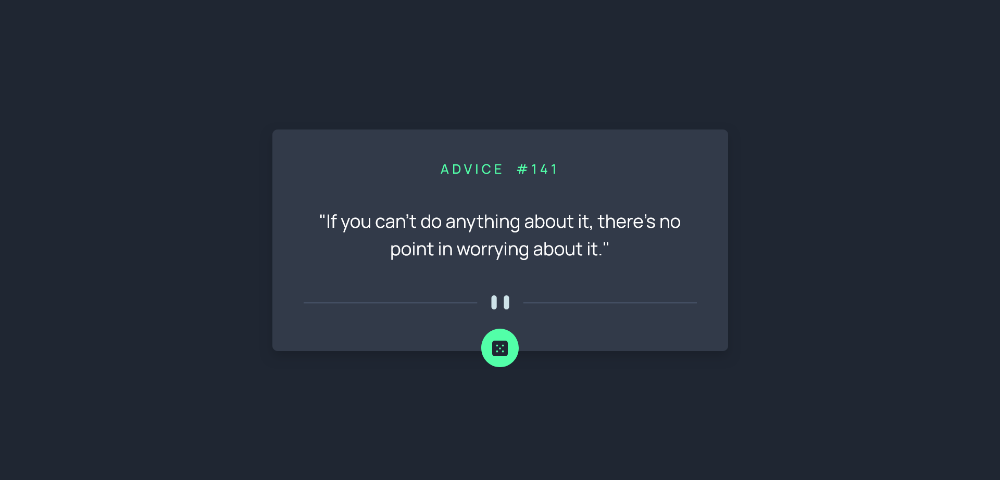

# Advice Generator App

The Advice Generator App is a simple web application that provides users with random pieces of advice. It features a clean and responsive design, making it easy for users to generate new advice at the click of a button.

## Table of Contents
- [Design](#design)
- [Features](#features)
- [Technologies Used](#technologies-used)
- [How to Use](#how-to-use)
- [Links](#links)
- [Author](#author)

## Design

## Features
- Responsive and modern user interface.
- Generates random advice with a simple click.
- Stylish and minimalistic design using Bootstrap.

## Technologies Used
- **HTML5**: Markup language for structuring the content.
- **CSS3**: For styling the application, including Bootstrap for responsive design.
- **JavaScript**: To handle user interactions and fetch random advice from an API.
- **Bootstrap**: A framework for building responsive, mobile-first web pages.

## How to Use

1. **Generate Advice:**
- Click on the dice button to generate a random piece of advice.
2. **Explore UI:**
- Enjoy the sleek and minimalist design of the app, optimized for both desktop and mobile devices.

## Links

- **Repo**: [Github Repo](https://github.com/basemsameh/Advice-Generator-App.git)
- **Demo**: [Live URL](https://basemsameh.github.io/Advice-Generator-App/)

## Author

- **Name**: [Basem](Basem)
- **GitHub**: [GitHub Profile](https://github.com/basemsameh)
- **Linkedin**: [Linkedin](https://www.linkedin.com/in/basem-sameh-671b5b212/)